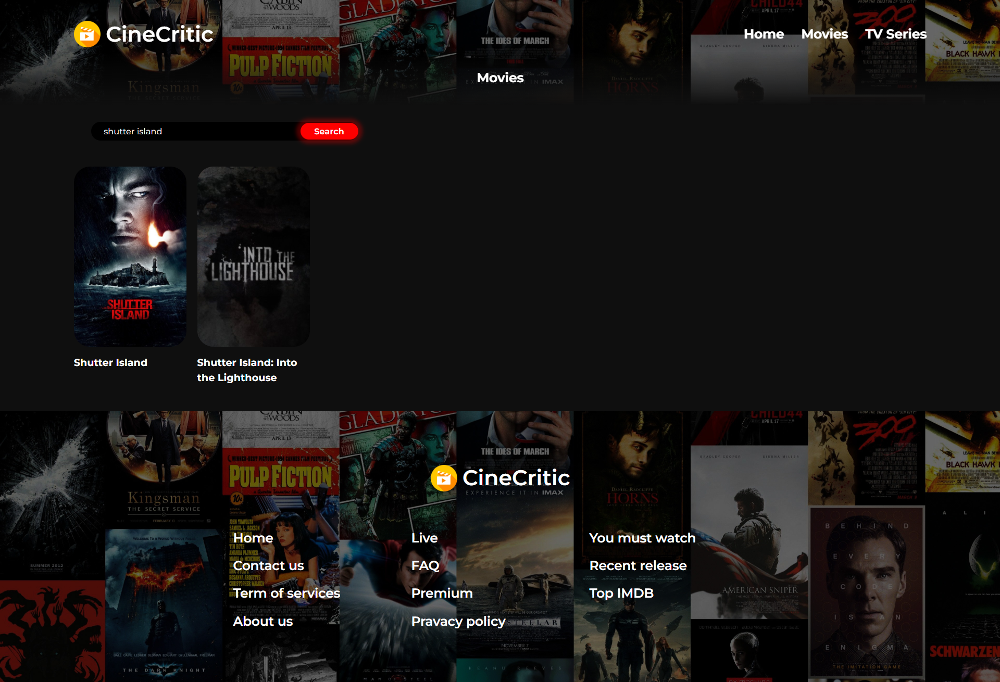

# CineCritic – Movie Discovery Platform

CineCritic is a responsive and user-friendly movie exploration web app built using React and the TMDB API. Users can search for movies, explore trending titles, view detailed information including cast, posters, and trailers — all within a smooth and modern interface.

## Features

- Real-time movie search
- Detailed movie pages with overview, poster and trailer
- Cast information
- Embedded trailer playback from YouTube
- Filter by type: Movies / TV Shows
- Responsive and clean UI/UX

## Tech Stack

- React
- JavaScript
- HTML & CSS
- TMDB API
- React Router

## Screenshots

### Homepage


### Search Result (e.g., Shutter Island)


### TV Show Detail Page (Breaking Bad)


### TV Series Listing (Optional)


## Getting Started

### Installation

```bash
git clone https://github.com/your-username/CineCritic.git
cd CineCritic
npm install
